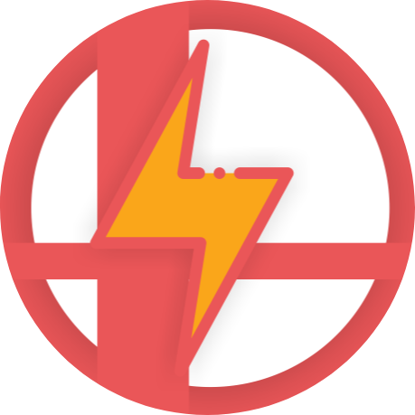

# Concept

This is the repository containing everything about the auto-smash project. It is a programmable nintendo switch controller based on the [Snowball Thrower](https://github.com/bertrandom/snowball-thrower), which is based on the [Splatmeme Printer](https://github.com/LightningStalker/Splatmeme-Printer), also based on the original reverse engineering project : [SwitchFightstick](https://github.com/shinyquagsire23/Switch-Fightstick).

## Contents

This repo contains : 
- The firmware for the board
- The bootloader for the board
- The board's PCB schematics
- The computer software for generating scripts
- Demos and example scripts for that project

